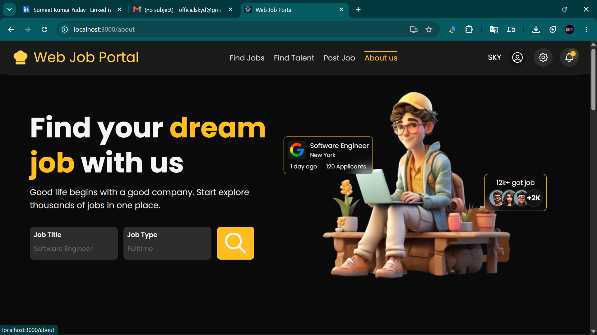
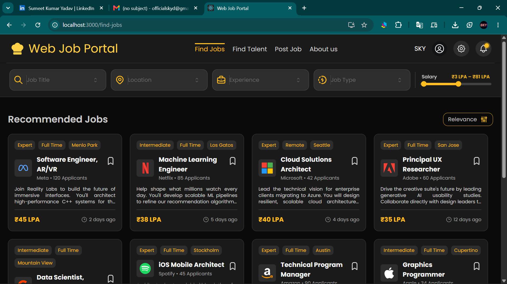
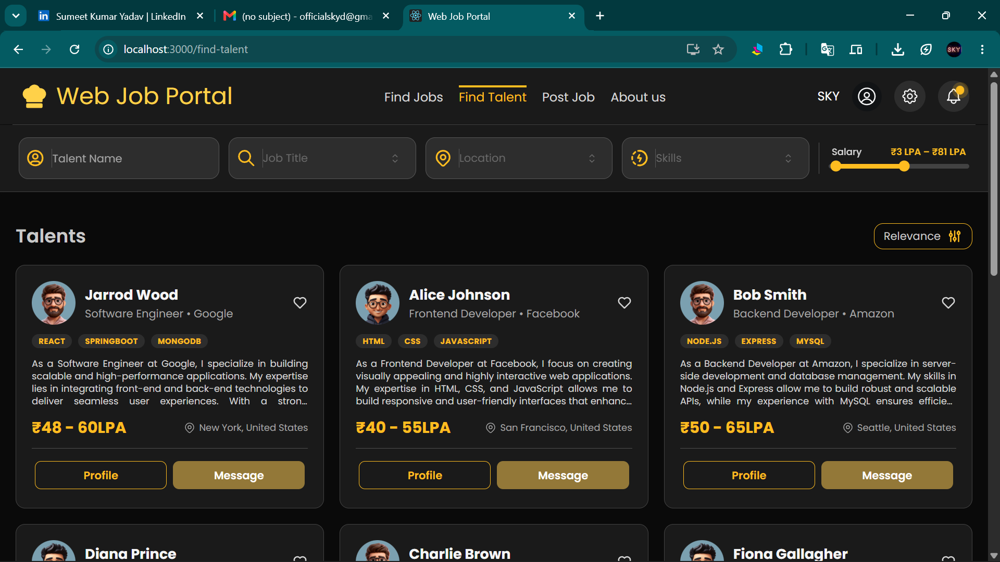
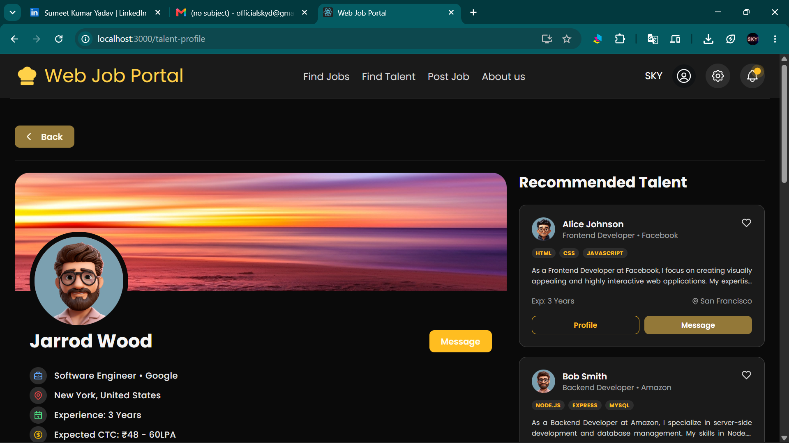
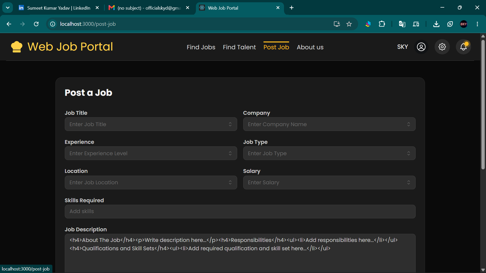

<div align="center">

# 💼 Web Job Portal

**A full-stack job portal I'm building with React and Spring Boot.**

[](https://react.dev/)
[](https://www.typescriptlang.org/)
[](https://tailwindcss.com/)
[](https://mantine.dev/)

<br/>

A job board where candidates can search for jobs and recruiters can post jobs and browse talent. I'm building it as a full-stack app, one piece at a time. The frontend is done; the backend is what I'm working on next.

**Status:** Frontend done ✅ · Backend coming next 🔨 (the frontend runs on mock data for now)

</div>

---

## 🖼️ Screenshots

**Home**



| Find Jobs | Find Talent |
| --- | --- |
|  |  |

| Talent Profile | Post a Job |
| --- | --- |
|  |  |

## 💡 Why I Built This
I've mostly made small practice apps before, so I wanted to try something bigger that feels closer to a real product. A job portal was a good fit because it has a lot of different parts — search, filters, profiles, forms — so I get to practice structuring a bigger React app and reusing components instead of repeating myself.

I'm building it from a product backlog (user stories for candidates and employers) and going through it step by step. Right now everything runs on mock data, and the Spring Boot + MongoDB backend is the next thing I'm picking up.

## 🛠 Tech Stack

| Frontend (done) | Backend & State (coming next) |
| --- | --- |
| React 19 + TypeScript | Java / Spring Boot |
| Tailwind CSS | MongoDB |
| Mantine UI | Spring Security + JWT (auth) |
| React Router | Redux (state management) |
| Tabler Icons | REST APIs + email notifications (OTP) |
| Embla Carousel · react-fast-marquee | |

## 🖥️ What's Built So Far (Frontend)

### 🏠 Home Page (`/`)
- **Hero section** with the search inputs.
- **Company marquee** — auto-scrolling logos using `react-fast-marquee`.
- **Job categories** — a carousel built with Embla.
- **How It Works** section with a step-by-step layout.
- **Testimonials** and a newsletter **Subscribe** block.

### 🔍 Find Jobs (`/find-jobs`)
- Search and filter bar (Job Title, Location, Experience) using a custom multi-select input.
- Salary range slider.
- Grid of job cards with sorting (Relevance, Recent, Salary).

### 🎯 Find Talent (`/find-talent`)
- Candidate browsing page with filters (Title, Location, Skills).
- Grid of talent cards showing skills and expected CTC.

### 👤 Talent Profile (`/talent-profile`)
- Profile view with experience and certification lists.
- A "save" heart toggle.
- A "recommended talent" section at the bottom.

### 📝 Post a Job (`/post-job`)
- Form to post a new job — title, company, experience, job type, location, salary, skills and description.
- For now it just logs the form data to the console (no backend yet).

### 🧭 Navigation
- Header with active-route highlighting and a notification bell.
- Footer with link columns and social icons.

> **Note:** a Job Description page (`JobDescPage.tsx`) is started but not wired into the routes yet.

## 🎨 Theming

The whole app uses a custom dark theme. The annoying part was getting Tailwind and Mantine to use the same colors — they each have their own setup. I fixed it by keeping one palette (`mine-shaft` for backgrounds, `bright-sun` for the accent) in both, with Poppins as the font.

**tailwind.config.js:**
```javascript
theme: {
  extend: {
    colors: {
      'mine-shaft': {
        50: '#f6f6f6',
        // ...
        950: '#2d2d2d',   // app background
      },
      'bright-sun': {
        50: '#fffbeb',
        // ...
        300: '#ffd149',   // buttons / accent
      },
    }
  }
}
```

## 📁 Project Structure

```
src/
├── Components/      # Shared reusable components (e.g. MultiInput)
├── Pages/           # Route pages (Home, FindJobs, FindTalent, PostJob, etc.)
├── LandingPage/     # Home page sections (Hero, Companies, Testimonials...)
├── FindJobs/        # Job search components (JobCard, SearchBar, Sort)
├── FindTalent/      # Talent search components (TalentCard, SearchBar)
├── TalentProfile/   # Profile, Experience, Certification, Recommend cards
├── PostJob/         # Post-a-job form components
├── Header/          # Navigation components
├── Footer/          # Footer components
└── Data/            # Mock data and TypeScript interfaces
```

## 🚀 Getting Started

1. **Clone the repo**
   ```bash
   git clone https://github.com/iamsky2002/JOB-PORTAL.git
   cd JOB-PORTAL
   ```

2. **Install dependencies**
   ```bash
   npm install
   ```

3. **Start the dev server**
   ```bash
   npm start
   ```
   Then open `http://localhost:3000`.

## 🛠️ Things I Ran Into (and Learned)
The project is still in progress, so here are a few things that didn't work the first time and how I figured them out:

- **Two themes not matching** — Tailwind and Mantine each have their own color setup, so my custom colors only showed up in one of them. I fixed it by adding the same `mine-shaft` / `bright-sun` palette to both `tailwind.config.js` and the Mantine theme, so the whole app uses one set of colors.
- **The custom multi-select filter** — I built the tag-style multi-select myself instead of using a library. Getting the add/remove tags and the dropdown to behave taught me a lot about handling state in React.
- **Too much repeated code** — my job card and talent card were almost the same copy-pasted code. I moved the common parts into a `Components/` folder so I only have to change things in one place now.

## 🗺 Roadmap

I'm working from a product backlog with user stories for both candidates and employers. The bigger picture:

**Frontend**
- [x] Landing page + responsive sections
- [x] Find Jobs (search, filters, sorting)
- [x] Find Talent + Talent Profile
- [x] Post a Job form
- [x] Mock data for all of the above
- [ ] Job Description + Apply Job pages
- [ ] Company Profile, Posted Jobs, Job History pages
- [ ] Login / Signup + user Profile page
- [ ] Responsive pass across all pages

**Backend & integration**
- [ ] Spring Boot project + MongoDB schemas
- [ ] Auth APIs (email/password, JWT, Spring Security)
- [ ] Email OTP (expires after 5 mins)
- [ ] Redux for app state
- [ ] Profile API (incl. resume upload)
- [ ] Job, Apply Job, and Posted Jobs APIs
- [ ] Filtering, sorting, and notifications
- [ ] Replace mock data with real API calls
- [ ] Deploy

---

### 👤 Built By
**Sumit (SKY)**

[](https://github.com/iamsky2002)
